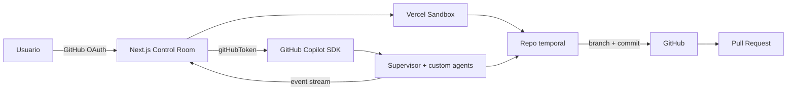

# AI Product Team · Control Room

Aplicación web para coordinar el equipo de agentes de producto y tecnología del repositorio y hacer que implemente cambios reales sobre GitHub usando **la propia suscripción de GitHub Copilot del usuario**.

El proyecto conserva los 83 perfiles de `.codex/agents`, las reglas de `AGENTS.md`, `EQUIPO.md` y `TOKEN_POLICY.md`, pero agrega una experiencia web: autenticación con GitHub, selector de modelo Copilot, ejecución aislada en Vercel Sandbox, visualización en vivo de cada agente y publicación del resultado como Pull Request.

## Qué hace

1. El usuario inicia sesión con GitHub OAuth.
2. La app consulta los modelos disponibles para esa cuenta mediante GitHub Copilot SDK.
3. El usuario indica repositorio, rama base, modelo y objetivo.
4. Vercel Sandbox clona el repositorio en una microVM aislada.
5. El runner carga el supervisor y el catálogo de agentes como `customAgents` de Copilot.
6. Copilot delega en los especialistas que necesita y la UI transmite mensajes, herramientas y handoffs en vivo.
7. El equipo implementa y verifica el cambio dentro del sandbox.
8. La app crea una rama nueva y abre un Pull Request. **Nunca mergea automáticamente.**



## Interfaz

La pantalla principal tiene tres áreas:

- **Trabajo:** repositorio, rama, modelo Copilot y objetivo.
- **Conversación del equipo:** streaming de lo que expresa cada agente y eventos de ejecución.
- **Equipo:** catálogo completo de perfiles, con estados `idle`, `selected`, `active`, `done` y `failed`, más modelo, herramienta, duración y métricas cuando Copilot las informa.

El contenido generado por IA se renderiza con el componente `MessageResponse` del patrón AI Elements/Streamdown para soportar Markdown en streaming, código, matemáticas y Mermaid.

## Arquitectura

- **Frontend / API:** Next.js 16 App Router.
- **IA:** `@github/copilot-sdk`.
- **Autenticación IA:** token de GitHub OAuth del usuario; Copilot consume su suscripción y sus modelos disponibles.
- **Ejecución:** `@vercel/sandbox` con workspace efímero.
- **Render de IA:** Streamdown + plugins usados por AI Elements.
- **Entrega:** Git branch + Pull Request por API de GitHub.

### Agentes

Los perfiles siguen viviendo en `.codex/agents/*.toml`. El runner los transforma en `customAgents` de Copilot. El supervisor se mantiene como coordinador y las especialidades se delegan dinámicamente según la tarea.

Los eventos `subagent.selected`, `subagent.started`, `subagent.completed`, `subagent.failed`, `assistant.message_delta`, `tool.execution_start` y `tool.execution_complete` alimentan la visualización en tiempo real.

## Seguridad

- El token OAuth se cifra con AES-256-GCM dentro de una cookie `httpOnly` y `sameSite=lax`.
- El token nunca se envía al JavaScript del navegador.
- El token llega al runner sólo para inicializar Copilot y se elimina de `process.env` antes de arrancar el runtime que expone herramientas de shell.
- Después del clon autenticado se reemplaza `origin` por una URL sin credenciales antes de entregar el workspace a los agentes.
- El push ocurre después de finalizar el runner y usa un header de autenticación temporal.
- El sandbox es efímero y se destruye al finalizar la ejecución.
- No se hace merge automático.
- No se versionan secretos reales.

## Configuración de GitHub OAuth

Creá una OAuth App en GitHub Developer Settings.

Para desarrollo local:

- Homepage URL: `http://localhost:3000`
- Authorization callback URL: `http://localhost:3000/api/auth/callback`

Para producción reemplazá el host por el dominio de Vercel:

- Authorization callback URL: `https://TU_DOMINIO/api/auth/callback`

La app solicita `repo read:user read:org` porque necesita leer/escribir repositorios autorizados y crear la rama/PR final.

## Variables de entorno

Copiá `.env.example` a `.env.local`:

```bash
cp .env.example .env.local
```

Configurá:

```env
GITHUB_CLIENT_ID=
GITHUB_CLIENT_SECRET=
SESSION_SECRET=
```

`SESSION_SECRET` debe tener al menos 32 caracteres.

En Vercel, Sandbox utiliza OIDC automáticamente. Para desarrollo local, si el proyecto no dispone de OIDC, también pueden configurarse:

```env
VERCEL_TOKEN=
VERCEL_TEAM_ID=
VERCEL_PROJECT_ID=
```

## Desarrollo local

Requiere Node.js 24 o superior.

```bash
npm install
npm run dev
```

Abrí `http://localhost:3000`.

Validación completa:

```bash
npm run check
```

Esto verifica la sintaxis del runner embebido, TypeScript y el build de Next.js.

## Deploy en Vercel

1. Importá este repositorio en Vercel.
2. Cargá `GITHUB_CLIENT_ID`, `GITHUB_CLIENT_SECRET` y `SESSION_SECRET`.
3. Actualizá el callback de la OAuth App con el dominio final.
4. Desplegá.

`vercel.json` activa Fluid Compute. El endpoint de ejecución usa Vercel Sandbox y mantiene un stream NDJSON hacia la UI durante el trabajo del equipo.

## Flujo Git generado por la app

Para cada ejecución se crea una rama similar a:

```text
ai/control-room-1789690000000
```

El equipo trabaja sólo dentro de esa rama temporal. Al finalizar:

- se detectan tanto cambios sin commit como commits creados accidentalmente por el agente;
- se genera un commit si quedaron cambios pendientes;
- se hace push de la rama;
- se crea un Pull Request hacia la rama base elegida.

## Kit de agentes existente

La aplicación no reemplaza las otras formas de usar el equipo. Siguen disponibles:

- `.codex/agents`: perfiles de agentes.
- `AGENTS.md`: reglas de coordinación.
- `EQUIPO.md`: roles, flujo y criterios de aceptación.
- `TOKEN_POLICY.md`: política de contexto y ahorro de tokens.
- `METRICAS_TOKENS.md`: medición cuando exista dato real.
- `.github/agents/supervisor.agent.md`: agente portable para VS Code/GitHub Copilot.
- `.codex-plugin/plugin.json`: plugin local.
- `AgentInteractionViewer/`: visor auxiliar histórico.
- scripts de instalación y validación para uso local/global.

Para el detalle funcional de los roles consultá [`EQUIPO.md`](./EQUIPO.md). Para el uso tradicional en VS Code consultá [`VSCODE.md`](./VSCODE.md).

## Estado de producción

La app requiere un proyecto Vercel conectado y una GitHub OAuth App válida para ejecutar el flujo extremo a extremo. El CI del repositorio valida build y tipos, pero una ejecución real de Copilot/Sandbox necesita credenciales de usuario y entorno Vercel autorizados.
